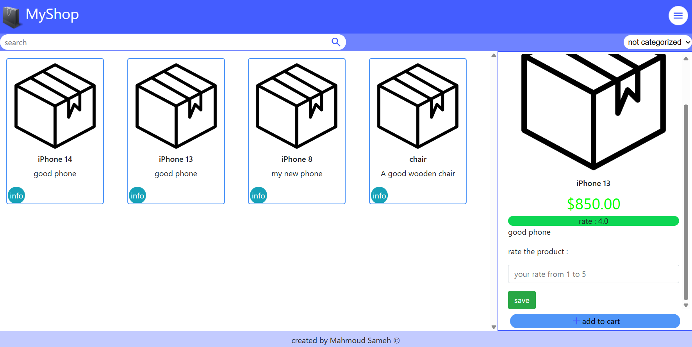
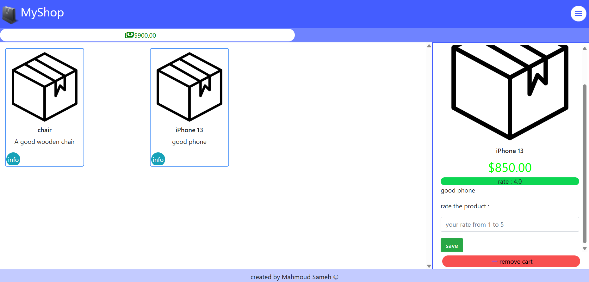
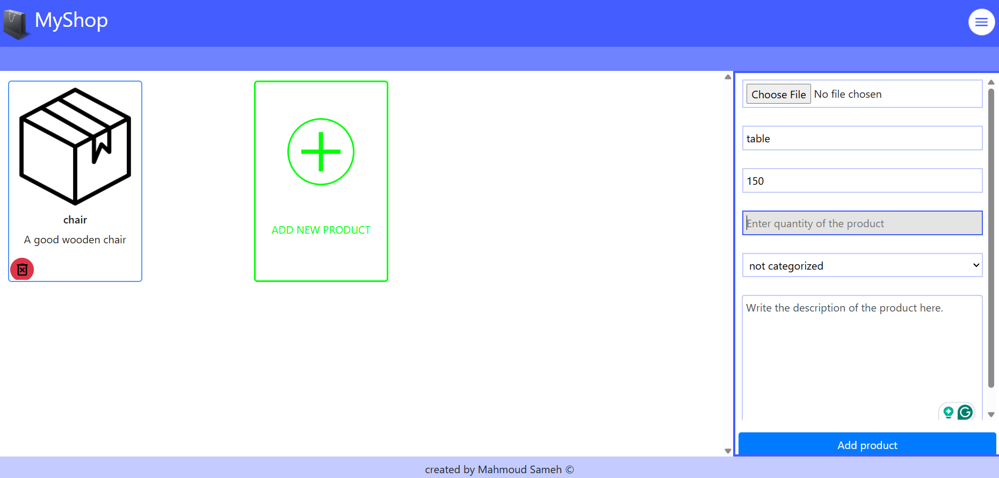

# Online Shop Project Documentation  

This document provides an overview of the **Online Shop** project built using the **Flask** framework. The application includes user authentication, product management, a shopping cart, and order processing.  

---

## 📌 Table of Contents  
1. [Project Overview](#-project-overview)  
2. [Features](#-features)  
3. [Database Schema](#-database-schema)  
4. [API Endpoints](#-api-endpoints)  
5. [Setup & Installation](#-setup--installation)  
6. [Screenshots](#-screenshots)  
7. [Future Improvements](#-future-improvements)  

---

## 🚀 Project Overview  
The **Online Shop** is a web application that allows users to:  
- Browse products  
- Add items to a cart  
- Rate products  
- Place orders  
- Manage profiles  

Admins can:  
- Add/delete products  
- View sales  

The project uses:  
- **Flask** (Python web framework)  
- **SQLite** (Database)  
- **Jinja2** (Templating engine)  

---

## ✨ Features  

### **User Features**  
✅ **Authentication** – Login, Register, Logout  
✅ **Product Browsing** – Search & filter products  
✅ **Shopping Cart** – Add/remove items  
✅ **Product Ratings** – Rate products (1-5 stars)  
✅ **Order History** – View past purchases  
✅ **Profile Management** – Update email & phone  

### **Admin Features**  
🛠 **Product Management** – Add/delete products  
📊 **Sales Overview** – View order history  

---

## 🗃 Database Schema  
The database consists of the following tables:  

### **Users** (`users`)  
| Column | Type | Description |  
|--------|------|-------------|  
| `id` | INTEGER | Primary Key |  
| `user_name` | TEXT | Username |  
| `password` | TEXT | Hashed password |  
| `email` | TEXT | User email |  
| `phone` | TEXT | User phone |  

### **Products** (`products`)  
| Column | Type | Description |  
|--------|------|-------------|  
| `prod_id` | INTEGER | Primary Key |  
| `name` | TEXT | Product name |  
| `price` | INTEGER | Product price |  
| `owner_id` | INTEGER | Admin who added the product |  
| `description` | TEXT | Product description |  
| `quantity` | INTEGER | Available stock |  
| `category_id` | INTEGER | Foreign Key (categories) |  

### **Categories** (`categories`)  
| Column | Type | Description |  
|--------|------|-------------|  
| `id` | INTEGER | Primary Key |  
| `name` | TEXT | Category name |  

### **Product Ratings** (`products_rate`)  
| Column | Type | Description |  
|--------|------|-------------|  
| `user_id` | INTEGER | Foreign Key (users) |  
| `product_id` | INTEGER | Foreign Key (products) |  
| `rate` | INTEGER | Rating (1-5) |  

### **Order Details** (`operations_details`)  
| Column | Type | Description |  
|--------|------|-------------|  
| `usre_id` | INTEGER | Foreign Key (users) |  
| `product_id` | INTEGER | Foreign Key (products) |  
| `oper_date` | DATETIME | Order date |  
| `price` | INTEGER | Price at purchase |  

---

## 🌐 API Endpoints  

| Endpoint | Method | Description |  
|----------|--------|-------------|  
| `/`, `/home` | GET | Homepage (product listing) |  
| `/cart` | GET, POST | Shopping cart management |  
| `/profile` | GET, POST | User profile updates |  
| `/admin` | GET, POST | Admin product management |  
| `/operations` | GET | Order history |  
| `/login` | GET, POST | User login |  
| `/logout` | GET | Logout |  
| `/register` | GET, POST | User registration |  

---

## 🛠 Setup & Installation  

### **Prerequisites**  
- Python 3.x  
- Flask (`pip install flask`)  
- CS50 SQL (`pip install cs50`)  

### **Steps**  
1. Clone the repository  
2. Navigate to the project directory  
3. Run:  
   ```sh
   python app.py
4. Access the app at http://localhost:5000


## 📸 Screenshots

<div align="center">
  
  <br>
  
  <br>
  
</div>

## 🔮 Future Improvements

### High Priority
- [ ] **Payment Gateway Integration**
  - Implement Stripe/PayPal for secure transactions
- [ ] **Enhanced Product Management**
  - Add bulk product upload via CSV
  - Inventory tracking system
- [ ] **User Dashboard**
  - Order tracking
  - Wishlist functionality

### Medium Priority
- [ ] **Advanced Search**
  - Price range filters
  - Category-based filtering
- [ ] **Review System**
  - Text reviews with ratings
  - Photo uploads for products
- [ ] **Responsive Design**
  - Mobile optimization
  - Dark mode support

### Low Priority
- [ ] **Recommendation Engine**
  - "Customers who bought this also bought..."
- [ ] **Multi-language Support**
  - Internationalization (i18n)
- [ ] **API Endpoints**
  - RESTful API for mobile apps

## 🎯 Conclusion

This Flask-based e-commerce platform provides a solid foundation for an online shop with:

✔ **Core Features:**
- User authentication (login/register)
- Product catalog
- Shopping cart
- Order processing
- Admin dashboard

✔ **Technical Highlights:**
- SQLite database with CS50 wrapper
- Session-based cart management
- Jinja2 templating
- Rate limiting protection


